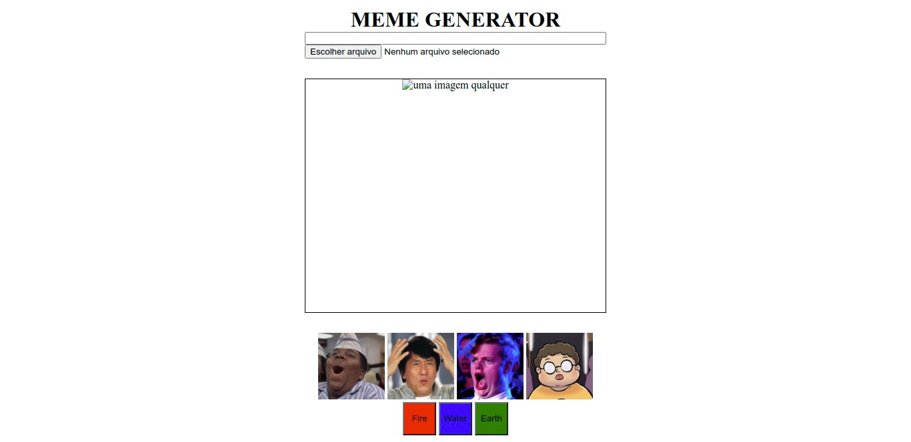

<h1 align="center">
  
</h1>

<h3 align="center">
  Curso realizado na Trybe - Edu Souza o/
</h3>

<blockquote align="center">“Cada sonho realizado é composto por pequenas batalhas vencidas no dia a dia.”</blockquote>

<h4 align="center">
  Repositório - Projeto Meme generator
</h4>

 

  &nbsp;
  &nbsp;
  

  <a href="#rocket-Sobre-o-projeto">Sobre o projeto</a>&nbsp; &nbsp; |&nbsp; &nbsp;
  <a href="#postbox-Entrega"">Entrega</a>&nbsp; &nbsp; |&nbsp; &nbsp;
  <a href="#unlock-Licença">Licença</a>

## :rocket: Sobre o projeto

#### Meme Generator

Neste projeto, você vai desenvolver um gerador de memes!
Você deve criar um site que permita o upload de uma imagem e a inserção de um texto sobre ela, estilizado de forma apropriada.

#### Screenshots:

   &nbsp;

## :postbox: Entrega

### :clipboard: Requisitos

- 
<a href="#1"> :pushpin: 1.</a> O site deve possuir uma caixa de texto com a qual quem usa pode interagir para inserir texto em cima da imagem escolhida.

- 
<a href="#2"> :pushpin: 2.</a> O site deve permitir que quem usa faça upload de uma imagem de seu computador.

- 
<a href="#3"> :pushpin: 3.</a> O site deve ter uma moldura no container. A moldura deve ter 1 pixel de largura, deve ser preta e do tipo 'solid'. A área onde a imagem aparecerá deve ter fundo branco.

- 
<a href="#4"> :pushpin: 4.</a> O texto que será inserido sobre a imagem deve ter uma cor, sombra e tamanho específicos.

- 
<a href="#5"> :pushpin: 5.</a> Limite o tamanho do texto que o usuário pode inserir.

- 
<a href="#6"> :pushpin: 6.</a> Permita a quem usa customizar o meme escolhido acrescentando a ele uma de três bordas. A página deve ter três botões, que ao serem clicados devem cada um trocar a própria borda ao redor do container.

- 
<a href="#7"> :pushpin: 7.</a> Tenha um conjunto de quatro imagens pré prontas de memes famosos para o usuário escolher. Mostre miniaturas das imagens e, mediante clique do usuário, essa imagem deve aparecer dentro da moldura do elemento de container.

### Concluído :rocket:

Acesse o deploy do projeto [aqui](https://edusouza-programmer.github.io/Trybe_Projeto_5-5_Edu_Souza/).

#
## :unlock: Licença

Este projeto está licenciado sob a Licença MIT - consulte [LICENSE](https://opensource.org/licenses/MIT) para maiores detalhes.
